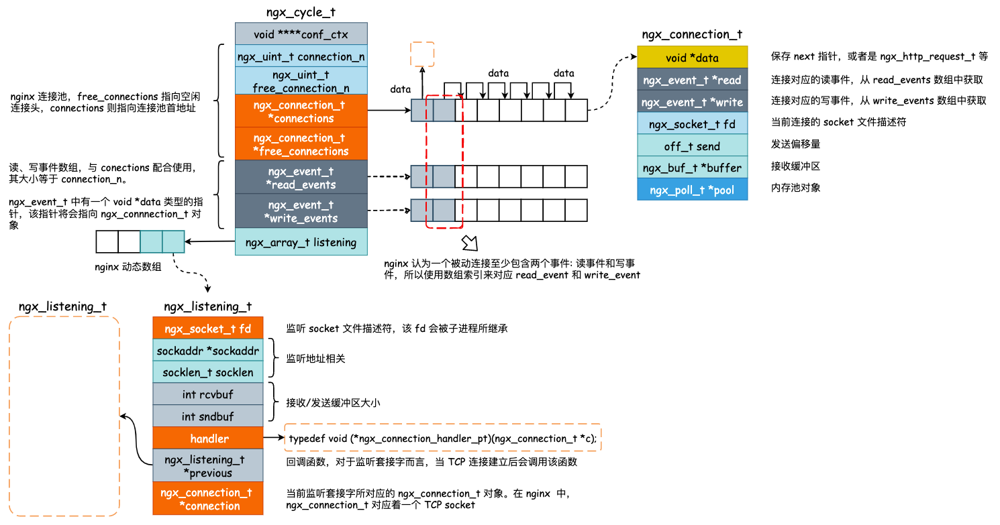

## 1. nginx 源码目录结构

```bash
.
├── auto          # 与编译相关的一些脚本文件，可执行文件 configure 将会使用到该目录下的文件
├── conf          # 默认的配置文件，比如 nginx.conf、uwsgi_params
├── contrib       # 脚本和工具，比较典型的就是 vim 高亮工具
├── html          # 就两个文件, 50x.html 和 index.html，index.html 就是 Welcome to nginx! 页面
├── man           # 帮助文件目录
├── objs          # 编译产生的临时文件
└── src           # 核心源码目录文件，包含了 nginx 运行的核心源码文件
    ├── core      # nginx 核心源码文件，包含了程序入口函数、数据结构的定义，以及 nginx 运行时的核心代码
    ├── event     # epoll 事件模型相关代码
    ├── http      # http 模块相关源码
    ├── mail      # mail 模块相关源码
    ├── misc      # 杂项，一些辅助代码
    ├── os        # 于 unix 操作系统相关的内容，可以认为是对 POSIX API 的一个封装
    └── stream    # stream 模块相关代码
```

如果以理解 nginx 的运行机理为目标的话，那么只需要阅读几个核心目录下的源码文件即可，包括 `src/code`, `src/event`, `src/http` 以及 `src/stream`。

其中 `src/http` 以及 `src/stream` 主要包含的是 HTTP 框架和 stream 机制的相关内容。而`src/code` 与 `src/event` 则是 nginx 运行时的核心代码文件，其中也隐藏着为什么 nginx 支持单机数十万的并发，以及 nginx 为什么运行如此之稳定的奥秘。

## 2. 前置知识点

- [信号](https://smartkeyerror.oss-cn-shenzhen.aliyuncs.com/Phyduck/linux-network/%E4%BF%A1%E5%8F%B7.pdf)
- [信号集与信号掩码](https://smartkeyerror.oss-cn-shenzhen.aliyuncs.com/Phyduck/linux-network/%E4%BF%A1%E5%8F%B7%E9%9B%86%E4%B8%8E%E4%BF%A1%E5%8F%B7%E6%8E%A9%E7%A0%81.pdf)
- [进程的创建](https://smartkeyerror.oss-cn-shenzhen.aliyuncs.com/Phyduck/linux-network/%E8%BF%9B%E7%A8%8B%E7%9A%84%E5%88%9B%E5%BB%BA.pdf)
- [进程间通讯简介](https://smartkeyerror.oss-cn-shenzhen.aliyuncs.com/Phyduck/linux-network/%E8%BF%9B%E7%A8%8B%E9%97%B4%E9%80%9A%E8%AE%AF%E7%AE%80%E4%BB%8B.pdf)
- [DAEMON](https://smartkeyerror.oss-cn-shenzhen.aliyuncs.com/Phyduck/linux-network/DAEMON.pdf)
- [socket 编程问题一览(01)](https://smartkeyerror.oss-cn-shenzhen.aliyuncs.com/Phyduck/linux-network/socket%20%E7%BC%96%E7%A8%8B%E9%97%AE%E9%A2%98%E4%B8%80%E8%A7%88%2801%29.pdf)
- [socket 编程问题一览(02)](https://smartkeyerror.oss-cn-shenzhen.aliyuncs.com/Phyduck/linux-network/socket%20%E7%BC%96%E7%A8%8B%E9%97%AE%E9%A2%98%E4%B8%80%E8%A7%88%2802%29.pdf)
- [epoll 原理剖析](https://smartkeyerror.oss-cn-shenzhen.aliyuncs.com/Phyduck/linux-network/epoll%20%E5%8E%9F%E7%90%86%E5%89%96%E6%9E%90.pdf)

## 3. nginx 核心数据结构与关键流程

### 3.1 核心结构概览

