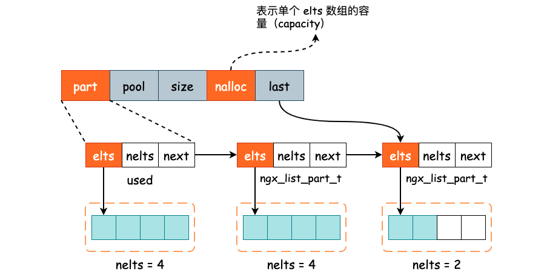
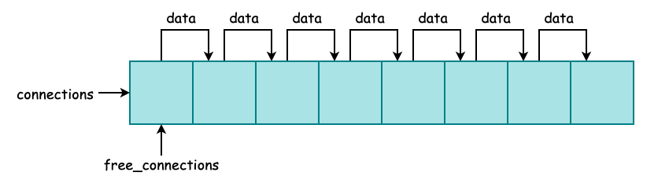
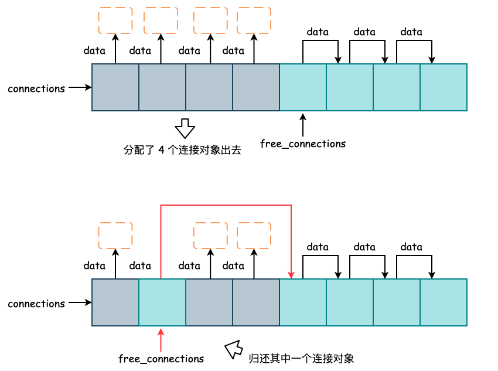
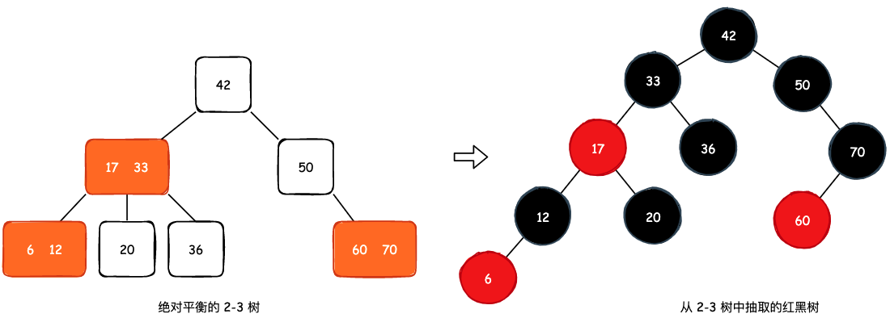
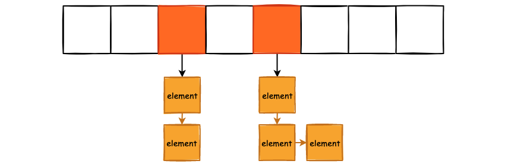
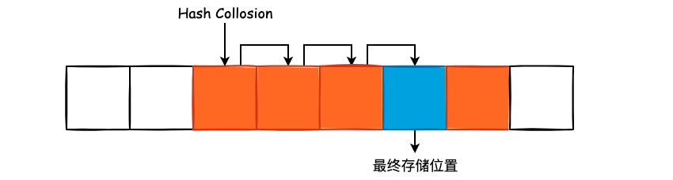
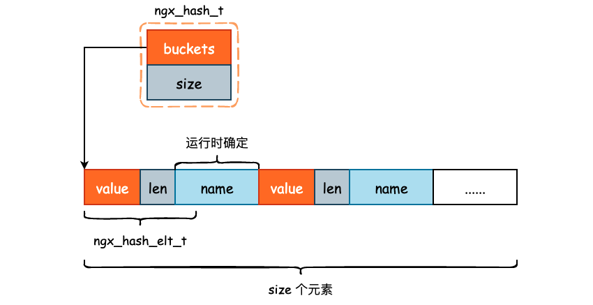

## Nginx 数据结构

### 1. `ngx_list_t` 单向链表

`ngx_list_t` 是一个非常特殊的单向链表容器，负责容器内元素内存的分配，并且并不是将单个的元素使用指针连接起来，而是使用多个内存段连接起来，更进一步地说，其实是将多个数组连接起来。也就是说，`ngx_list_t` 其实更像是一个“数组 + 链表”的组合体，定义在 `src/core/ngx_list.h` 中。

```cpp
typedef struct ngx_list_part_s  ngx_list_part_t;

struct ngx_list_part_s {
    void             *elts;     // 即 elements，指向数组的起始地址
    ngx_uint_t        nelts;    // 即 number of elements，当前数组已经保存了多少元素，nelts 必须小于 ngx_list_t 中的 nalloc
    ngx_list_part_t  *next;     // 单向链表指针，指向下一个 ngx_list_part_t 结构
};


typedef struct {
    ngx_list_part_t  *last;     // 指向单向链表的最后一个元素，相当于一个 tail 指针
    ngx_list_part_t   part;     // 这里就很有意思了，它不是一个指针，保存的是单向链表的首个元素
    size_t            size;     // 这里指的是保存在 elts 数组中的元素大小
    ngx_uint_t        nalloc;   // 表示 elts 数组的初始大小，或者说初始容量，一旦确定便不可更改
    ngx_pool_t       *pool;     // 内存池对象，用于分配用户所需要保存对象的内存
} ngx_list_t;
```


也就是说，链表中的节点类型为 `ngx_list_part_t`，该结构中除了保存指向下一个节点的 `next` 指针以外，还保存着 `elts` 数组的指针，也就是链表的元素并不是保存单一的对象，而是保存一组对象。所以我们才说 `ngx_list_t` 是一个“数组+链表”的组合体，如下图所示:




nginx 一共为 `ngx_list_t` 提供了 3 个主要的 API：

- `ngx_list_create()`, 创建一个新的链表
- `ngx_list_init()`，初始化一个已有的链表
- `ngx_list_push()`，向链表中添加一个元素

`ngx_list_push()` 是一个非常有意思的 API，其函数实现为

```cpp
// 以下代码删去了错误检查，节省一些空间
void *ngx_list_push(ngx_list_t *l) {
    void             *elt;
    ngx_list_part_t  *last;

    // 获取单向链表的 tail 节点
    last = l->last;

    // 如果最后一个节点的数组已经写满了，那么此时就需要再创建一个 ngx_list_part_t 对象
    if (last->nelts == l->nalloc) {
        // 从 pool 内存池中分配出一个 ngx_list_part_t 对象
        last = ngx_palloc(l->pool, sizeof(ngx_list_part_t));

        // 从 pool 内存池中分配出 elts 数组所需内存
        last->elts = ngx_palloc(l->pool, l->nalloc * l->size);
        
        // 初始化 ngx_list_part_t 对象
        last->nelts = 0;
        last->next = NULL;

        // 调整 ngx_list_t->last 指针的指向，使其指向新的 tail 节点，并将 tail 节点挂接在原有的 tail 节点后面儿
        l->last->next = last;
        l->last = last;
    }

    // 取出数组空闲位置的内存地址，返回给调用方
    elt = (char *) last->elts + l->size * last->nelts;
    last->nelts++;

    return elt;
}
```

也就是说，该函数仅接受一个单向链表对象，在函数内部通过 `pool` 内存池分配完内存以后，直接将内存的地址返回，再由用户向该地址内写入相应的数据。以保存 `ngx_str_t` 对象的链表为例，演示一下 `ngx_list_t` 相关 API 的使用:

```cpp
// 创建一个每个 elts 数组能保存 4 个 ngx_str_t 的单向链表对象
ngx_list_t *str_list = ngx_list_create(pool, 4, sizeof(ngx_str_t));

// 新增一个数组元素对象，可能会导致新创建一个 ngx_list_part_s 对象
ngx_str_t *str = ngx_list_push(str_list);

// 在返回的内存地址中写入我们需要写入的数据
str->len = sizeof("Hello Nginx");
str->data = "Hello Nginx"
```

通过 `ngx_list_push()` 源码可以得知，`elts` 数组一定是顺序写入的，假如当前的 `ngx_list_part_t.elts` 数组已经写满了，也就是数组元素个数达到了 `ngx_list_t.nalloc`。那么此时再写入数据时将会新建一个 `ngx_list_part_t` ，并将其挂到单向链表的尾部，然后向其中的 `elts` 数组写入元素。


### 2. socket 连接池

严格意义上来说，socket 连接池并不属于 nginx 数据结构中的一部分，它只是对数组和链表的一个简单应用而已。但是连接池在日常开发中实在是太常见了，所以将 nginx 的连接池拿出来详细描述下，日后也好有一个对比。

nginx 中一个 socket 连接使用 `ngx_connection_t` 表示，该结构中保存了与 `epoll` 相关的读事件、写事件，以及接收缓冲区，对端 socket 的 IP 地址与端口等信息:

```cpp
struct ngx_connection_s {
    void               *data;
    ngx_event_t        *read;       // 连接对应的读事件，从 read_events 数组中获取
    ngx_event_t        *write;      // 连接对应的写事件，从 write_events 数组中获取

    ngx_socket_t        fd;         // 当前连接的 TCP socket 句柄
    
    // ......
}
```

其实我们只需要关注 `data` 字段即可。在 nginx 初始化时，data 指针充当 TCP 连接池中节点的指针，也就是说，`data` 将指向下一个 `ngx_connection_t` 对象。当连接被使用时，那么 `data` 指针可以用于保存业务所需要的数据，例如在 HTTP 框架中就保存了 `ngx_http_request_t` 对象。连接归化给连接池时，`data` 指针再次变成 next 指针，指向下一个空闲连接。

`ngx_connection_t` 连接对象在 `ngx_cycle_t` 中使用，由以下字段进行表示:

```cpp
struct ngx_cycle_s {
     // 连接池首地址，与 free_connections 搭配使用
    ngx_connection_t         *connections;
    // 可用空闲连接指针
    ngx_connection_t         *free_connections;
    
    // 连接池总大小
    ngx_uint_t                connection_n;
    // 空闲连接数量，也就是还能够分配出多少个连接出去
    ngx_uint_t                free_connection_n;
    
    // ......
}
```

`connections` 所指向的连接池对象为一个静态数组，在 nginx 启动时即被初始化，并且初始化的大小由配置文件所指定，该大小与 nginx 所能支持的最大并发量有关。同时， `ngx_connection_t` 之间通过 `data` 指针进行连接，那么整体看起来就是这个样子:



在连接的分配与归还过程中，`connections` 指针不进行任何改变，`free_connections` 则永远指向一个可用的连接对象。当进行连接分配时，则取出 `free_connections` 所指向的对象，并将 `free_connections` 指向该对象的下一个节点。当对象归还时，则直接让 `free_connections` 指向该归还的空闲对象，并让该对象的 `data` 指针指向原来 `free_connections` 所指向的空闲对象，本质上就是在链表的头部插入数据，然后更改头节点:



这种使用静态数组+链表实现的池化对象非常常见，并且算是一个经典的数据结构，因此是必须要掌握的。不仅仅是 nginx，C++ STL、数据库连接池均采用了这种池化方式，既能够在 `O(1)` 时间内寻找到一个空闲连接，同时也能够利用数组的局部特性利用 CPU Cache，并且能够有效的优化连接对象创建、销毁的时间代价。

最后，与连接池对象强相同的 API 其实只有 2 个，分别是获取空闲连接以及归还连接，创建连接池并没有使用一个函数完成，而是直接写在了 `ngx_event_process_init` 方法中:

```cpp
// 获取空闲连接
ngx_connection_t *ngx_get_connection(ngx_socket_t s, ngx_log_t *log);

// 归还连接
void ngx_free_connection(ngx_connection_t *c);
```

### 3. 红黑树

和 Linux 内核一样，Nginx 也大量地使用了红黑树这一经典树结构，主要用于实现定时器以及文件缓存。理解红黑树的一个关键点就在于理解 2-3 树，在 《算法》(第四版) 中有详细的描述，这里只简单地分析一下 2-3 树这棵绝对平衡的多叉树和红黑树之间的等价关系。



如上图所示，对于 2-3 树而言，我们只需要将其 3-节点的左侧节点变成红色节点，其余节点变成黑色节点，就可以得到一棵红黑树，并且满足红黑树的关键性质: **从任一节点到其每个叶子节点的所有简单路径都包含相同数目的黑色节点**。

其根本原因就在于 2-3 树是一棵绝对平衡的树，那么从根节点到任意一叶子节点的路径都是相等的。而将 2-3 树转换成红黑树的过程中，我们将 3-节点中的其中一个元素设置成红黑树中的红色节点，其余元素均为黑色节点，并没有破坏 2-3 树绝对平衡的性质，所以才有了黑色节点相等的性质。

正因为有了红色节点的插入，使得红黑树的平衡性并不如 AVL 树，故查询效率略低于 AVL 树。但是同样由于红色节点的存在，使得红黑树中在插入节点时的旋转次数更少，因此有着更高的插入和删除效率。

Nginx 红黑树有一个比较有意思的地方就在于可以自定义向红黑树中添加元素的方法:

```cpp
typedef struct ngx_rbtree_node_s  ngx_rbtree_node_t;

// 红黑树节点
struct ngx_rbtree_node_s {
    // unsigned long 类型的 key
    ngx_rbtree_key_t       key;
    // 左孩子节点
    ngx_rbtree_node_t     *left;
    // 右孩子节点
    ngx_rbtree_node_t     *right;
    // 父亲节点
    ngx_rbtree_node_t     *parent;
    // 节点颜色，0 为黑色，1 为红色
    u_char                 color;
    u_char                 data;
};

typedef struct ngx_rbtree_s  ngx_rbtree_t;

// 红黑树
struct ngx_rbtree_s {
    // 根节点
    ngx_rbtree_node_t     *root;
    // 哨兵节点，即 NULL
    ngx_rbtree_node_t     *sentinel;
    // 向红黑树中插入节点的方法，我们可自定义实现
    ngx_rbtree_insert_pt   insert;
};
```

我们会发现 `ngx_rbtree_node_t` 并没有保存节点 value 的字段，`data` 字段只有一个字节，连指针都放不下，那么红黑树节点保存的数据到底存放在哪儿? 实际上，`ngx_rbtree_node_t` 只是一个“父类”结构，红黑树中保存的具体元素由客户端决定，比如想要保存 String 的话，那么就再封装一层即可:

```cpp
typedef struct {
    ngx_rbtree_node_t         node;
    ngx_str_t                 str;
} ngx_str_node_t;
```

当调用红黑树所提供的方法时，比如 `ngx_rbtree_insert`，需要将 `ngx_str_node_t` 类型的指针强制转换成 `ngx_rbtree_node_t`。这样的实现拓展性更好并且更加地灵活，也就是说，Nginx 红黑树实际上是提供了一个抽象类，部分细节的实现由业务决定。

`ngx_rbtree_insert_pt` 则是一个函数指针，可由业务方自行编写相关的逻辑。对于红黑树这种 key-value 的树结构来说，同一个 key 可以存在多个对象，也可以只存在一个对象。key 到底能不能够重复是由业务端所决定的，Nginx 只是提供了一个默认的实现。

Nginx 自身实现了 3 种向红黑树中添加元素的方法，函数原型如下:

```cpp
// 向红黑树中添加节点，每一个 key 都是唯一的，不允许重复
void ngx_rbtree_insert_value(
    ngx_rbtree_node_t *root, 
    ngx_rbtree_node_t *node, 
    ngx_rbtree_node_t *sentinel);

// 向红黑树中添加节点，每一个 key 表示时间或者是时间差
void ngx_rbtree_insert_timer_value(
    ngx_rbtree_node_t *root,
    ngx_rbtree_node_t *node, 
    ngx_rbtree_node_t *sentinel);
    
// 定义在 src/core/ngx_string.h 中，表示向红黑树中添加 String 类型的节点，允许同一个 key 存在多个对象
void ngx_str_rbtree_insert_value(
    ngx_rbtree_node_t *temp,
    ngx_rbtree_node_t *node, 
    ngx_rbtree_node_t *sentinel);
```

### 4. 支持通配符的哈希表

哈希表和数组可能是我们日常开发中使用的最多的两种数据结构了，但是带有通配符的哈希表却是比较少见的。在配置 Nginx 的 URI 路径的时候，我们经常会使用 "*" 来作为域名或者是请求路径的通配符，为了支持这样的特性，Nginx 实现了支持带有通配符的哈希表。

值得一提的是，**Nginx 实现的哈希表采用了开放寻址法来解决哈希冲突**。首先我们大致地讨论下拉链法和开放地址法的优缺点，然后再讨论为什么 Nginx 选择了开放寻址法。

拉链法是指当出现了哈希冲突时，我们将具有相同哈希值的元素全部都丢到一个链表中，在查询时遍历该链表，直到找到与 QueryKey 相同的元素:



有时，为了提高查询效率，还会将链表转换为红黑树，比如 JDK 中 HashMap。

使用拉链法实现的哈希表在元素的插入和删除操作上会更简单。插入时，如果发送哈希碰撞的话，只需要将元素插入到链表的头结点即可；删除也只需要将对应的节点从链表上摘除。并且，拉链法可以容忍更大的装载因子（Load Factor，现有元素/动态数组容量）。但是，由于链表并不是连续的数据结构，因此无法充分利用 CPU Cache，所以在查询效率上可能会略低于开放寻址法。

开放寻址法通常会使用连续非空槽的线性探测来实现，也就是当出现了哈希冲突时从当前 bucket 线性地往后扫描，直到找到一个空的 bucket:



很明显地，开放寻址法对装载因子有着更高的要求，如果当前哈希表的 Load Factor 为 0.99 的话，那么我们寻找一个空槽的时间复杂度将可能会达到 `O(n)`。但是，由于冲突的 Key 会产生“抱团”现象，也就是集中在某一些区域内，因此可以更好的利用 CPU Cache。

因此，我们可以得到这样的一个基本结论: 当所要存储的数据量更小时，开放地址法会有着更高的查询效率，因为能够更好的利用 CPU Cache。当数据量较多时，由于开放地址法对 Load Factor 有着更高的要求，所以使用内存空间将会更多，并且产生哈希冲突的概率将大幅度提升，所以此时使用拉链法会更好。

而对于 Nginx 来说，哈希表更多的是用于保存配置文件中的 URI 路径，几乎不会进行修改和删除，并且我们可以发现 `src/core/ngx_hash.h` 文件中根本就没有声明删除和修改的相关 API，所以可以完全不用考虑开放寻址法中删除和修改的低效操作。并且，配置文件项本身并不会很多，数据量一般也就在几十到几百之间，产生哈希冲突的概率并不会很高，而且还能更好的利用 CPU Cache。

```cpp
// ngx_hash_elt_t 为哈希表中的元素类型，其大小是不定的
typedef struct {
    // 指向实际保存的 value
    void             *value;
    // key 的长度
    u_short           len;
    // key 的首地址，name 实际上是一个变长数组
    u_char            name[1];
} ngx_hash_elt_t;


typedef struct {
    // 指向哈希表的首地址
    ngx_hash_elt_t  **buckets;
    // 哈希表中 bucket 总数
    ngx_uint_t        size;
} ngx_hash_t;
```

Nginx 哈希表主要有两部分所组成，一部分是对哈希表的全局概览，包括底层数组的指针以及容量，另一部分则是哈希表中具体存储的元素，由 `ngx_hash_elt_t` 所表示。注意到 `ngx_hash_elt_t` 的大小是不定的，主要是 `name` 的大小不固定，因此只有在初始化哈希表时才能够确定。



接着我们来看 Nginx 是如何支持带有通配符的散列表的，原理其实非常简单，其实就是**预处理**。

如果关键字是前置通配符，例如 `*.example.com` 的话，那么就额外地建立一个前置通配符散列表，在插入元素时仅插入 `example.com`。在查询时，如果待查询的 Key 为 `blog.example.com` 的话，那么就将其转换成 `example.com`，然后在前置通配符哈希表中进行查询。

如果关键字是后置通配符，例如 `example.*` 的话，那么就额外建立一个后置通配符散列表，在插入元素时仅插入 `example`。在查询时，如果待查询的 Key 为 `ewxample.com.cn` 的话，将其转换成 `example`，然后在后置通配符哈希表中进行查询。

Nginx 使用 `ngx_hash_combined_t` 来实现支持精确查询、前置通配符查询以及后置通配符查询哈希表:

```cpp
typedef struct {
    // 精确查询 hashmap
    ngx_hash_t            hash;
    // 前置通配符匹配 hashmap
    ngx_hash_wildcard_t  *wc_head;
    // 后置通配符匹配 hashmap
    ngx_hash_wildcard_t  *wc_tail;
} ngx_hash_combined_t;
```

`ngx_hash_combined_t` 中 hashmap 的定义顺序也很有意思，回顾一下 Nginx 配置文件中 `server_name` 的匹配规则:

- 首先，选择能够完全匹配的 `server_name`，例如 smartkeyerror.com
- 再次，选择前置通配符能够匹配的 `server_name`，例如 *.smartkeyerror.com
- 最后，选择后置通配符能够匹配的 `server_name`，例如 smartkeyerror.com.*

因此，当我们在 `ngx_hash_combined_t` 这一综合 hashmap 中查询数据时，会根据精确匹配、前置匹配以及后置匹配的顺序进行查询。


### 5. 小结

Nginx 中除了上述所总结的 4 种数据结构以外，其实还有双向链表所实现的队列、前缀树实现的基数树以及动态数组，由于这些数据结构要么没有什么特殊的地方，要么使用场景比较受限，因此未在文中详述。

知悉这些数据结构一方面可以为我们自定义模块时提供通用的容器，另一方面则是能够更好地理解 Nginx 源码本身。如果想要理清一个复杂且庞大的系统到底做了什么，从数据结构入手是一个比较好的切入点。


